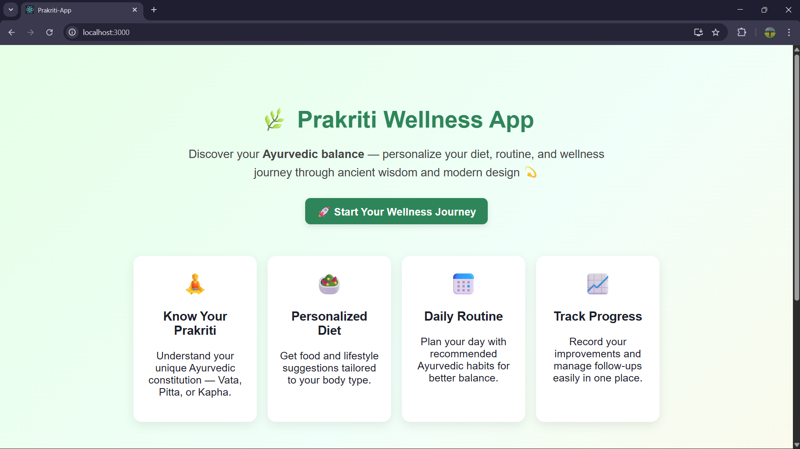
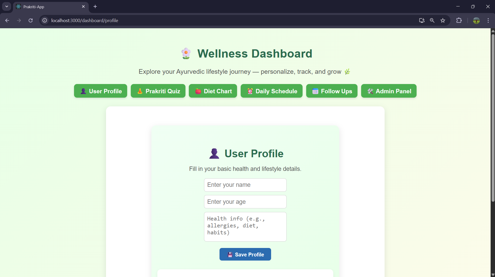
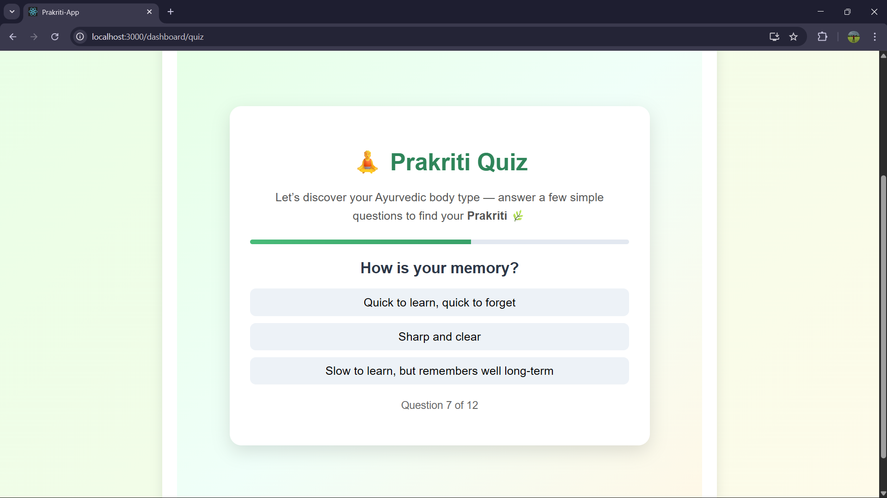
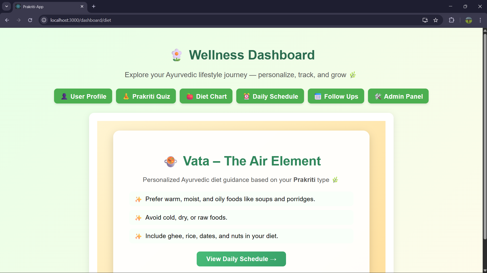
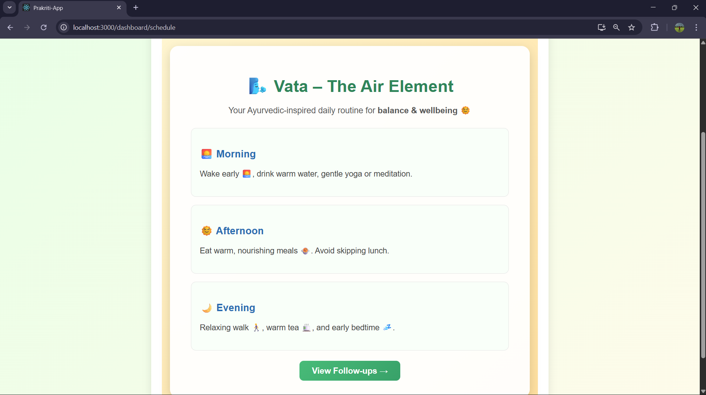
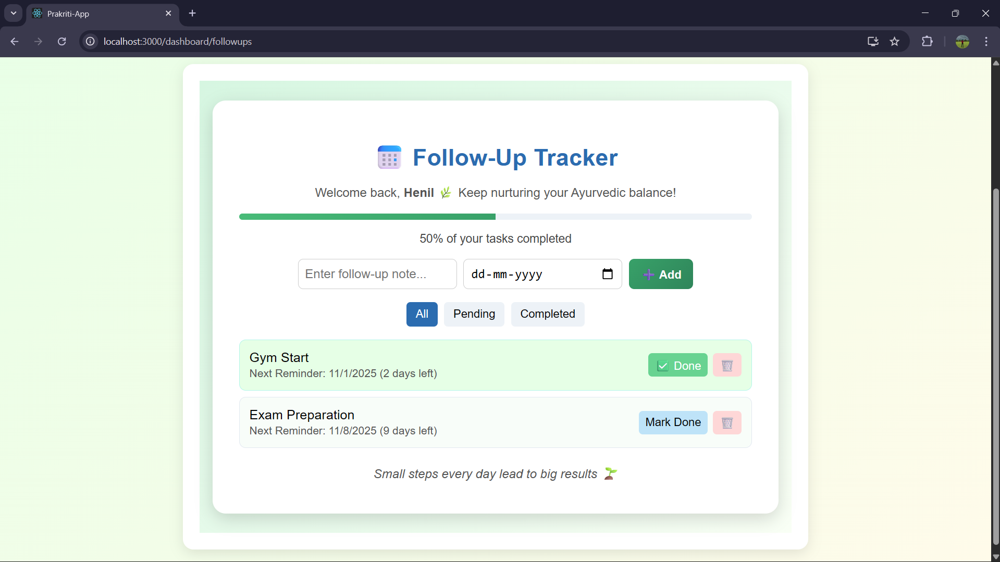

# 🌿 Prakriti App – Ayurvedic Prakriti Analysis

📖 Description
AyurHealth is a modern React-based web application designed to analyze an individual’s Prakriti (body constitution) based on Ayurvedic principles — Vata, Pitta, and Kapha.
It provides personalized health insights, recommendations, and allows users to store and view their profiles conveniently.

This app promotes self-awareness and helps users maintain a healthy balance between body and mind using traditional Ayurveda concepts combined with modern web technology.

⚙️ Installation Steps

Follow these steps to set up the project locally:

# 1️⃣ Clone the repository

git clone https://github.com/HenilPaatel-02/prakriti-app

# 2️⃣ Navigate into the project directory

cd prakriti-app

# 3️⃣ Install dependencies

npm install

# 4️⃣ Start the development server

npm start

▶️ How to Run the Project

After running npm start, open your browser and go to:

👉 http://localhost:3000

You’ll see the AyurHealth home screen.
From there, you can navigate to the Dashboard, User Profile, or Prakriti Analysis sections.

💡 Technologies Used

⚛️ React.js – Frontend framework

💅 CSS – Custom styling and layouts

🧠 JavaScript (ES6+) – Logic and interactivity

💾 LocalStorage – Save user profiles and Prakriti data

📂 React Router – Page navigation

✨ Features

✅ Identify your Prakriti type (Vata, Pitta, Kapha)
✅ Save and view personalized user profiles
✅ Clean, mobile-friendly UI with modern gradient themes
✅ Dashboard with follow-up and note management
✅ Smooth navigation between Home, Dashboard, and Profile

## 🖼️ Project Screenshots

  

  

  

  

  

  

  

👨‍💻 Author

Henil R. Patel
📧 [22amtics083@gmail.com]

📜 License

This project is open-source and available under the MIT License.
